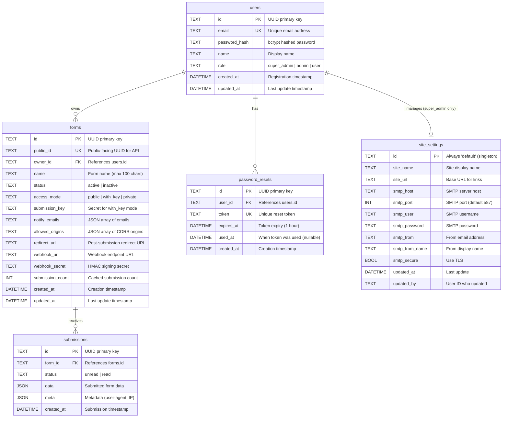

# HeadlessForms Entity & Architecture Audit

> **Audit Date**: 2026-01-08  
> **Project**: HeadlessForms - Headless Form Manager  
> **Stack**: Go (Backend) + SvelteKit (Frontend) + SQLite

---

## Table of Contents

1. [Entity Relationship Diagram](#entity-relationship-diagram)
2. [Entity Specifications](#entity-specifications)
3. [CRUD Operations Matrix](#crud-operations-matrix)
4. [Architecture Overview](#architecture-overview)
5. [API Reference](#api-reference)

---

## Entity Relationship Diagram



---

## Entity Specifications

### 1. User Entity

**File**: `internal/core/domain/user.go`

| Field          | Type      | JSON Tag     | Description                 |
| -------------- | --------- | ------------ | --------------------------- |
| `ID`           | string    | `id`         | UUID primary key            |
| `Email`        | string    | `email`      | Unique email address        |
| `PasswordHash` | string    | `-` (hidden) | bcrypt hashed password      |
| `Name`         | string    | `name`       | Display name                |
| `Role`         | UserRole  | `role`       | super_admin, admin, or user |
| `CreatedAt`    | time.Time | `created_at` | Registration timestamp      |
| `UpdatedAt`    | time.Time | `updated_at` | Last update                 |

**Role Hierarchy**:

```
super_admin → Full system access, settings management
     ↓
   admin → User management, all forms access
     ↓
    user → Own forms only
```

**Methods**:

- `SetPassword(password string) error` - Hash and set password
- `CheckPassword(password string) bool` - Verify password
- `Validate() error` - Validate email required
- `ToPublic() *UserPublic` - Safe API representation

---

### 2. Form Entity

**File**: `internal/core/domain/model.go`

| Field             | Type       | JSON Tag           | Description               |
| ----------------- | ---------- | ------------------ | ------------------------- |
| `ID`              | string     | `id`               | UUID primary key          |
| `OwnerID`         | string     | `owner_id`         | User who created form     |
| `PublicID`        | string     | `public_id`        | Public-facing UUID        |
| `Name`            | string     | `name`             | Form name (max 100 chars) |
| `Status`          | FormStatus | `status`           | active or inactive        |
| `NotifyEmails`    | []string   | `notify_emails`    | Notification recipients   |
| `AllowedOrigins`  | []string   | `allowed_origins`  | CORS origins              |
| `RedirectURL`     | string     | `redirect_url`     | Post-submission redirect  |
| `WebhookURL`      | string     | `webhook_url`      | Webhook endpoint          |
| `WebhookSecret`   | string     | `webhook_secret`   | HMAC secret               |
| `AccessMode`      | string     | `access_mode`      | public, with_key, private |
| `SubmissionKey`   | string     | `submission_key`   | Secret for with_key mode  |
| `SubmissionCount` | int        | `submission_count` | Cached count              |
| `CreatedAt`       | time.Time  | `created_at`       | Creation timestamp        |
| `UpdatedAt`       | time.Time  | `updated_at`       | Last update               |

**Access Modes**:

- `public` - Anyone can submit (default)
- `with_key` - Requires `_submission_key` hidden field
- `private` - Only authenticated users can submit

---

### 3. Submission Entity

**File**: `internal/core/domain/model.go`

| Field       | Type             | JSON Tag     | Description               |
| ----------- | ---------------- | ------------ | ------------------------- |
| `ID`        | string           | `id`         | UUID primary key          |
| `FormID`    | string           | `form_id`    | Foreign key to Form       |
| `Status`    | SubmissionStatus | `status`     | unread or read            |
| `Data`      | json.RawMessage  | `data`       | Submitted form data       |
| `Meta`      | json.RawMessage  | `meta`       | Metadata (user-agent, IP) |
| `CreatedAt` | time.Time        | `created_at` | Submission timestamp      |

---

### 4. PasswordResetToken Entity

**File**: `internal/core/domain/user.go`

| Field       | Type        | JSON Tag     | Description                      |
| ----------- | ----------- | ------------ | -------------------------------- |
| `ID`        | string      | `id`         | UUID primary key                 |
| `UserID`    | string      | `user_id`    | Foreign key to User              |
| `Token`     | string      | `token`      | Base64 URL-safe token (32 bytes) |
| `ExpiresAt` | time.Time   | `expires_at` | 1 hour from creation             |
| `UsedAt`    | \*time.Time | `used_at`    | When used (nullable)             |
| `CreatedAt` | time.Time   | `created_at` | Creation timestamp               |

---

### 5. SiteSettings Entity (Singleton)

**File**: `internal/core/domain/settings.go`

| Field          | Type      | JSON Tag         | Description             |
| -------------- | --------- | ---------------- | ----------------------- |
| `ID`           | string    | `id`             | Always "default"        |
| `SiteName`     | string    | `site_name`      | Site title              |
| `SiteURL`      | string    | `site_url`       | Base URL                |
| `SMTPHost`     | string    | `smtp_host`      | SMTP server             |
| `SMTPPort`     | int       | `smtp_port`      | SMTP port (default 587) |
| `SMTPUser`     | string    | `smtp_user`      | SMTP username           |
| `SMTPPassword` | string    | `smtp_password`  | Masked in GET           |
| `SMTPFrom`     | string    | `smtp_from`      | From email              |
| `SMTPFromName` | string    | `smtp_from_name` | From name               |
| `SMTPSecure`   | bool      | `smtp_secure`    | Use TLS                 |
| `Version`      | string    | `version`        | System version          |
| `UpdatedAt`    | time.Time | `updated_at`     | Last update             |
| `UpdatedBy`    | string    | `updated_by`     | User ID                 |

---

## CRUD Operations Matrix

### Legend

- ✅ Complete - Fully implemented
- ⚠️ Partial - Missing some operations
- ❌ Missing - Not implemented

### Users

| Operation | Repository                  | Service                      | API                                    | Status |
| --------- | --------------------------- | ---------------------------- | -------------------------------------- | ------ |
| Create    | `Create()`                  | `Register()`, `CreateUser()` | `POST /auth/register`, `POST /users`   | ✅     |
| Read One  | `GetByID()`, `GetByEmail()` | `GetUserByID()`              | `GET /auth/me`                         | ✅     |
| Read List | `List()`                    | `ListUsers()`                | `GET /users`                           | ✅     |
| Update    | `Update()`                  | `UpdateUser()`               | `PUT /users/{id}`, `PUT /auth/profile` | ✅     |
| Delete    | `Delete()`                  | `DeleteUser()`               | `DELETE /users/{id}`                   | ✅     |
| Count     | `Count()`                   | `HasUsers()`                 | `GET /auth/setup`                      | ✅     |

### Forms

| Operation | Repository                                            | Service        | API                  | Status |
| --------- | ----------------------------------------------------- | -------------- | -------------------- | ------ |
| Create    | `Create()`                                            | `CreateForm()` | `POST /forms`        | ✅     |
| Read One  | `GetByID()`, `GetByPublicID()`                        | `GetForm()`    | `GET /forms/{id}`    | ✅     |
| Read List | `List()`, `ListPaginated()`, `ListByOwnerPaginated()` | `ListForms*()` | `GET /forms`         | ✅     |
| Update    | `Update()`                                            | `UpdateForm()` | `PUT /forms/{id}`    | ✅     |
| Delete    | `Delete()`                                            | `DeleteForm()` | `DELETE /forms/{id}` | ✅     |

### Submissions

| Operation     | Repository                                | Service                          | API                                  | Status |
| ------------- | ----------------------------------------- | -------------------------------- | ------------------------------------ | ------ |
| Create        | `Create()`                                | `Submit()`                       | `POST /submissions/{form_id}`        | ✅     |
| Read One      | `GetByID()`                               | `GetSubmission()`                | `GET /submissions/{id}`              | ✅     |
| Read List     | `GetByFormID()`, `GetByFormIDPaginated()` | `ListSubmissions*()`             | `GET /forms/{id}/submissions`        | ✅     |
| Update Status | `UpdateStatus()`                          | `MarkAsRead()`, `MarkAsUnread()` | `PUT /submissions/{id}/read\|unread` | ✅     |
| Delete        | `Delete()`                                | `DeleteSubmission()`             | `DELETE /submissions/{id}`           | ✅     |

### Password Reset Tokens

| Operation      | Repository        | Service                  | API                          | Status |
| -------------- | ----------------- | ------------------------ | ---------------------------- | ------ |
| Create         | `Create()`        | `RequestPasswordReset()` | `POST /auth/forgot-password` | ✅     |
| Read           | `GetByToken()`    | (internal)               | -                            | ✅     |
| Mark Used      | `MarkAsUsed()`    | `ResetPassword()`        | `POST /auth/reset-password`  | ✅     |
| Delete Expired | `DeleteExpired()` | (internal)               | -                            | ✅     |

### Site Settings

| Operation | Repository | Service | API                        | Status |
| --------- | ---------- | ------- | -------------------------- | ------ |
| Read      | `Get()`    | -       | `GET /settings`            | ✅     |
| Update    | `Save()`   | -       | `PUT /settings`            | ✅     |
| Test SMTP | -          | -       | `POST /settings/test-smtp` | ✅     |

---

## Architecture Overview

```
┌─────────────────────────────────────────────────────────────────┐
│                         Frontend (SvelteKit)                     │
│  ┌──────────┐ ┌──────────┐ ┌──────────┐ ┌──────────┐ ┌────────┐ │
│  │Dashboard │ │  Forms   │ │  Users   │ │ Settings │ │  Auth  │ │
│  └────┬─────┘ └────┬─────┘ └────┬─────┘ └────┬─────┘ └───┬────┘ │
└───────┼────────────┼────────────┼────────────┼───────────┼──────┘
        │            │            │            │           │
        v            v            v            v           v
┌─────────────────────────────────────────────────────────────────┐
│                          API Layer                               │
│  ┌────────────────┐ ┌────────────────┐ ┌─────────────────────┐  │
│  │  AuthHandler   │ │  FormHandler   │ │  SettingsHandler    │  │
│  └───────┬────────┘ └───────┬────────┘ └──────────┬──────────┘  │
│          │                  │                     │              │
│  ┌───────┴──────────────────┴─────────────────────┴───────────┐ │
│  │              Auth Middleware (JWT Validation)               │ │
│  └─────────────────────────────────────────────────────────────┘ │
└───────┬─────────────────────────────────────────────────────────┘
        │
        v
┌─────────────────────────────────────────────────────────────────┐
│                        Service Layer                             │
│  ┌──────────────┐ ┌──────────────┐ ┌────────────┐ ┌───────────┐ │
│  │ AuthService  │ │ FormService  │ │SubmService │ │StatsService│ │
│  └──────┬───────┘ └──────┬───────┘ └─────┬──────┘ └─────┬─────┘ │
└─────────┼────────────────┼───────────────┼──────────────┼───────┘
          │                │               │              │
          v                v               v              v
┌─────────────────────────────────────────────────────────────────┐
│                     Repository Layer (Ports)                     │
│  ┌────────────┐ ┌────────────┐ ┌──────────────┐ ┌─────────────┐ │
│  │UserRepo    │ │FormRepo    │ │SubmissionRepo│ │SettingsRepo │ │
│  │PasswordRepo│ │            │ │StatsRepo     │ │             │ │
│  └─────┬──────┘ └─────┬──────┘ └──────┬───────┘ └──────┬──────┘ │
└────────┼──────────────┼───────────────┼────────────────┼────────┘
         │              │               │                │
         v              v               v                v
┌─────────────────────────────────────────────────────────────────┐
│                      Adapter Layer (SQLite)                      │
│  ┌─────────────────────────────────────────────────────────────┐ │
│  │                        Store                                 │ │
│  │  UserRepository, FormRepository, SubmissionRepository, etc. │ │
│  └─────────────────────────────────────────────────────────────┘ │
└─────────────────────────────────────────────────────────────────┘
```

---

## API Reference

### Authentication Endpoints

| Method | Endpoint                       | Auth | Description             |
| ------ | ------------------------------ | ---- | ----------------------- |
| POST   | `/api/v1/auth/register`        | No   | Register new user       |
| POST   | `/api/v1/auth/login`           | No   | Login and get JWT       |
| GET    | `/api/v1/auth/me`              | Yes  | Get current user        |
| GET    | `/api/v1/auth/setup`           | No   | Check if setup needed   |
| POST   | `/api/v1/auth/forgot-password` | No   | Request password reset  |
| POST   | `/api/v1/auth/reset-password`  | No   | Complete password reset |
| PUT    | `/api/v1/auth/profile`         | Yes  | Update own profile      |
| PUT    | `/api/v1/auth/password`        | Yes  | Change own password     |

### User Management Endpoints (Admin)

| Method | Endpoint                  | Auth  | Description     |
| ------ | ------------------------- | ----- | --------------- |
| GET    | `/api/v1/users`           | Admin | List all users  |
| POST   | `/api/v1/users`           | Admin | Create new user |
| PUT    | `/api/v1/users/{user_id}` | Admin | Update user     |
| DELETE | `/api/v1/users/{user_id}` | Admin | Delete user     |

### Form Endpoints

| Method | Endpoint                              | Auth | Description                   |
| ------ | ------------------------------------- | ---- | ----------------------------- |
| GET    | `/api/v1/forms`                       | Yes  | List forms (filtered by role) |
| POST   | `/api/v1/forms`                       | Yes  | Create new form               |
| GET    | `/api/v1/forms/{form_id}`             | Yes  | Get form details              |
| PUT    | `/api/v1/forms/{form_id}`             | Yes  | Update form                   |
| DELETE | `/api/v1/forms/{form_id}`             | Yes  | Delete form                   |
| GET    | `/api/v1/forms/{form_id}/stats`       | Yes  | Get form statistics           |
| GET    | `/api/v1/forms/{form_id}/submissions` | Yes  | List form submissions         |
| GET    | `/api/v1/forms/{form_id}/export/csv`  | Yes  | Export submissions as CSV     |

### Submission Endpoints

| Method | Endpoint                              | Auth     | Description            |
| ------ | ------------------------------------- | -------- | ---------------------- |
| POST   | `/api/v1/submissions/{form_id}`       | Optional | Submit to form         |
| GET    | `/api/v1/submissions/{sub_id}`        | Yes      | Get submission details |
| PUT    | `/api/v1/submissions/{sub_id}/read`   | Yes      | Mark as read           |
| PUT    | `/api/v1/submissions/{sub_id}/unread` | Yes      | Mark as unread         |
| DELETE | `/api/v1/submissions/{sub_id}`        | Yes      | Delete submission      |

### Settings Endpoints (Super Admin)

| Method | Endpoint                     | Auth        | Description             |
| ------ | ---------------------------- | ----------- | ----------------------- |
| GET    | `/api/v1/settings`           | Super Admin | Get site settings       |
| PUT    | `/api/v1/settings`           | Super Admin | Update site settings    |
| POST   | `/api/v1/settings/test-smtp` | Super Admin | Test SMTP configuration |

### System Endpoints

| Method | Endpoint             | Auth  | Description          |
| ------ | -------------------- | ----- | -------------------- |
| GET    | `/api/health`        | No    | Health check         |
| GET    | `/api/v1/stats`      | Yes   | Dashboard statistics |
| POST   | `/api/v1/admin/seed` | Admin | Seed test data       |

---

_Document generated: 2026-01-08_
